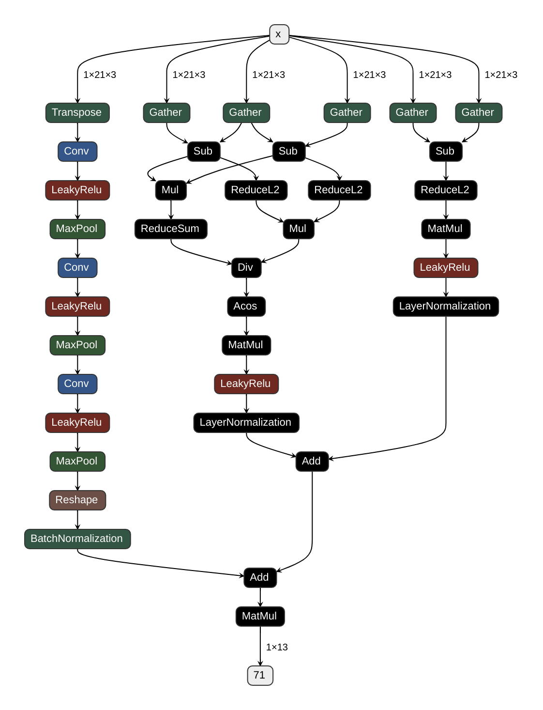

# palm-control

- This is a python application that uses the `mediapipe` library to detect the hand and fingers and control the mouse
  pointer using the palm and fingers.
- It uses a Neural Network to classify the gestures and perform the corresponding action.
- Uses `ONNX` runtime to run the model.
- Uses `Tkinter` for the GUI.
- Uses `multi-threading` to run the model and the GUI separately.
- Has audio recognition using `OpenAI's Whisper` model.
- Runs on `Windows` and `Linux`.

# Setup

Download [MODEL LINK](https://storage.googleapis.com/mediapipe-models/hand_landmarker/hand_landmarker/float16/1/hand_landmarker.task)

- place the model in the `./models` directory

- create a virtual environment using `python -m venv venv`
- install the required packages using `pip install -r requirements.txt`
- run the script using `python app.py`
- to exit the script press `esc` key

# Notes

### 07-05-2024 - My disappointment is immeasurable and my day is ruined

In linux you can use `scrcpy` to use your mobile as a webcam

```shell
sudo modprobe v4l2loopback exclusive_caps=1 card_label="Scrcpy Webcam"
scrcpy --video-source=camera --no-audio  --camera-size=1920x1080 --camera-id=0 --camera-fps=60 --v4l2-sink=/dev/video0 --no-video-playback
```

This will stream the video from the mobile **at 60 fps** to the `/dev/video0` which can be used as a webcam

# Things done

- [x] Hand detection
- [x] Filtering the hand cords
- [x] Speech to text using Whisper
- [x] GUI for the app
- [x] Mouse movement
- [x] Gesture classification
- [x] Training code and Dataset creation code
- [x] ONNX model inference

## GestureNet Classes


| Class Name | Action     | Description                |
| :-------- | :------- | :------------------------- |
| `NONE` | - | - |
| `CLOSED_PALM` | Closed hand | None |
| `INDEX_POINTING` | Point index finger | Mouse move |
| `OPEN_PALM` | Open hand | Mouse move |
| `THUMB_MIDDLE_TOUCH` | Pinch thumb and middle finger | Mouse left button |
| `THUMB_RING_TOUCH` | Pinch thumb and ring finger | Mouse right button |
| `THUMB_PINKY_TOUCH` | Pinch thumb and pinky | Text input with voice |
| `3_FINGER_PINCH` | Pinch thumb, index and middle | Mouse drag |
| `5_FINGER_PINCH` | Pinch with all fingers | Mouse scroll |
| `THUMBS_UP` | Thumbs Up | Volume up |
| `THUMBS_DOWN` | Thumbs Down | Volume down |
| `MIDDLE_UP` | Middle finger upwards | Copy text |
| `MIDDLE_DOWN` | Middle finger downwards | Paste text |


## Architecture Diagram


## Workflow Diagram


## GestureNet Architecture



## User Interface of Palm Control


